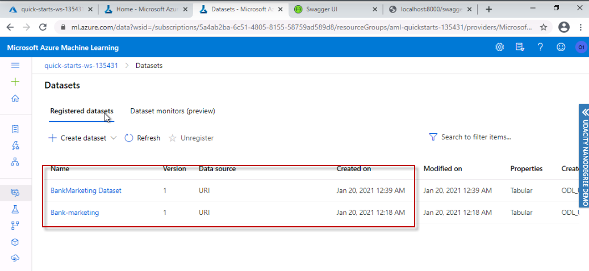
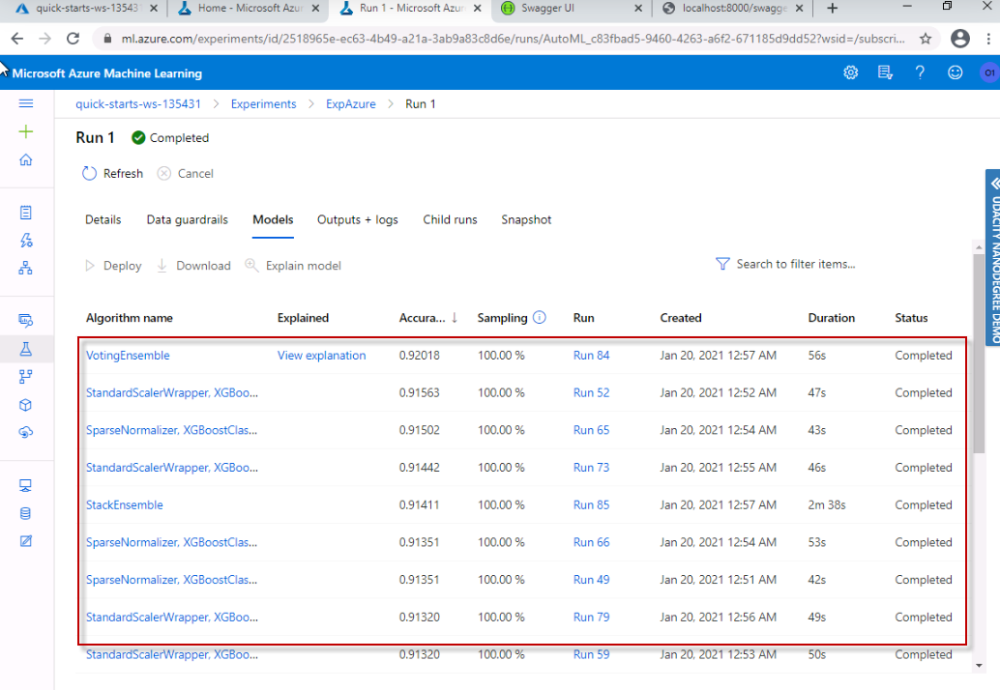
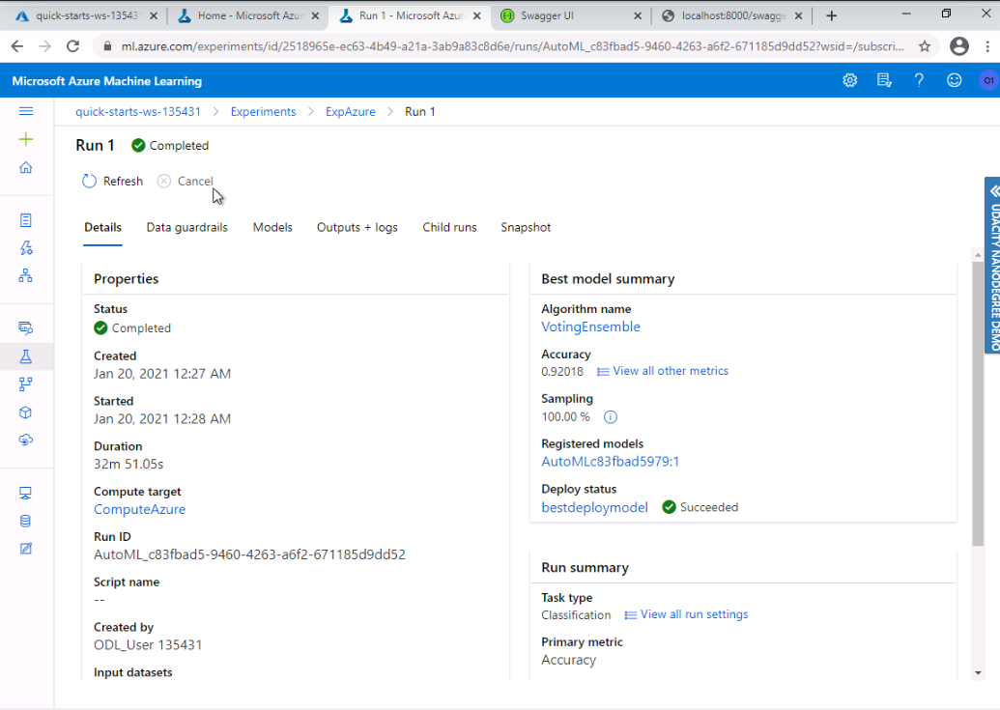
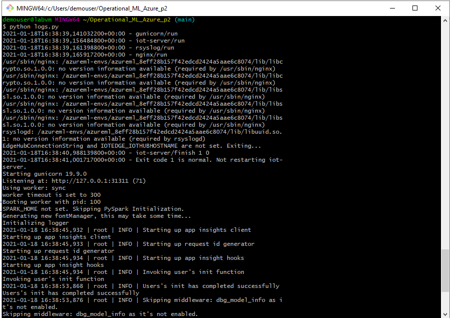
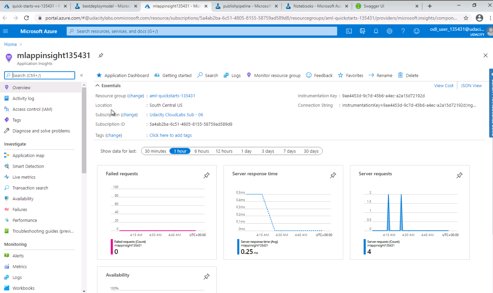
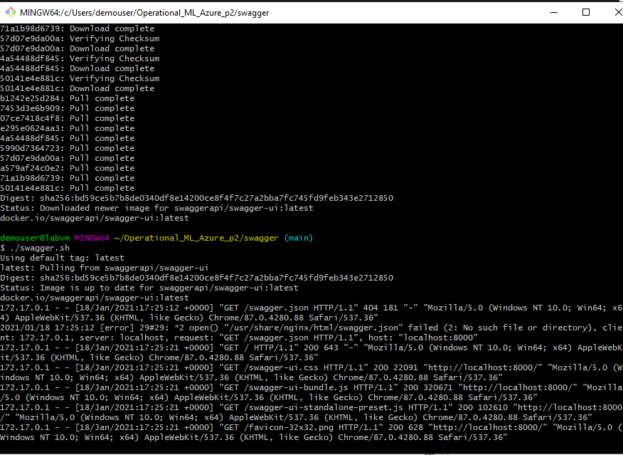
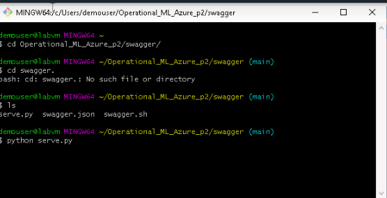

# Operataionalizing Machine Learning

This project is part of Nano degree program Machine Learning with Microsoft from Udacity. We created all the steps to create ML project with authentification , using the option of Auto ML microsoft provide us, Deployment and finding the best model , enable logging for reviewing details in the process, consume models endpoints and create and publish a pipeline , and last Documentation. 

## Architectural Diagram

1) Authentication.- In this step we configurate the authorization step but in this case we are using a udacity workspace. so We are skiping this part.

2) Auto ML model.- We are going to use the AutoML from Microsoft this give us the possibility to automatic find between many different algorithms and parameters to find the best model. 

3) Deploy the best model.-We are going to deploy the model found in the previous step to later cosume it.

4) Enable logging.- We are goint to enable the logging option to monitor the logs of the model

5) Documentation: We are going to document the model using the Swagger.

6) Consume model endpoints.- We are going to consume the model .

7) Create and publish a pipeline.- We are going to publish the application with the model to be used.

## Key Steps
### 1.Authentication
We skip this step since you are not authorized to create a security principal.
### 2. Auto ML Model.

Registered Datasets in ML Studio showing that Bankmarketing dataset available

Screenshot showing that the experiment is shown as completed.

Screenshot of the best model after the experiment completes

### Step 3: Deploy the Best Model
The Best Model is showed for deployment.
Deploying the Best Model will allow to interact with the HTTP API service and interact with the model by sending data over POST requests.

### Step 4: Enable Application Insights

For this step we have to download first the file config.json and later to run: python logs.py.
This will give you the information about logs of the deployment .

We can also monitor and view logs. it is configurable at deploy time with a check-box.

### Step 5: Swagger Documentation
We download the Swagger JSON file for deployed models in the Azure and we run swagger.sh will download the latest Swagger container with Docker, and it will run it on port 80 by default.
After we run serve.py will start a Python server on port 8000. This script needs to be right next to the downloaded swagger.json 

We run swagger.sh for creation of the Apache application for Documentation and port open in 8000.

$ ./swagger.sh

Previous download the swagger.json in the deployment model we run:
$ python serve.py

### Step 6: Consume Model Endpoints
We can cosume the model for this test we need to run:  ( Don't forget to update the endpoint and key)

We can se the result based in the json data we are passing  variables to predict  if the client has suscribed a term deposit and the result is in the image.

Two sets of data to score, so we get two results back
data = {"data":
        [
          {
            "age": 17,
            "campaign": 1,
            "cons.conf.idx": -46.2,
            "cons.price.idx": 92.893,
            "contact": "cellular",
            "day_of_week": "mon",
            "default": "no",
            "duration": 971,
            "education": "university.degree",
            "emp.var.rate": -1.8,
            "euribor3m": 1.299,
            "housing": "yes",
            "job": "blue-collar",
            "loan": "yes",
            "marital": "married",
            "month": "may",
            "nr.employed": 5099.1,
            "pdays": 999,
            "poutcome": "failure",
            "previous": 1
          },
          {
            "age": 87,
            "campaign": 1,
            "cons.conf.idx": -46.2,
            "cons.price.idx": 92.893,
            "contact": "cellular",
            "day_of_week": "mon",
            "default": "no",
            "duration": 471,
            "education": "university.degree",
            "emp.var.rate": -1.8,
            "euribor3m": 1.299,
            "housing": "yes",
            "job": "blue-collar",
            "loan": "yes",
            "marital": "married",
            "month": "may",
            "nr.employed": 5099.1,
            "pdays": 999,
            "poutcome": "failure",
            "previous": 1
          },
      ]
    }

$ python endpoint.py 

### Step 7: Create and publish pipeline
We use Jupyter Notebook provided with the steps to have all the steps. 

## Screen Recording
Screen recording link.

## Standout Suggestions
Enable the option with  Deeplearning in AutoML configuration could improve the accuracy of the model and GPU option trying other compute target.

Balancing the data is also an option to improve the accuracy of the models.

